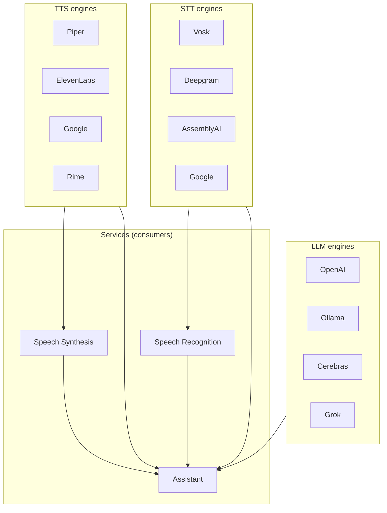

# Engines

**Architecture**  
Engines

**Engines** are pluggable backends for speech and language: text-to-speech (TTS), speech-to-text (STT), and language models (LLMs). They live under `ubo_app/engines/` and are used by the assistant, speech synthesis, and speech recognition services.

## What you see

- **Abstraction** — `engines/abstraction/`:
  - **engine.py** — `EngineMixin` base with `name`, `label`, `instance_label`.
  - **ai_provider_mixin.py**, **background_running_mixin.py**, **needs_setup_mixin.py**, **remote_mixin.py** — Mixins for API-backed or on-device engines.
- **TTS** — e.g. **Piper** (`piper.py`), **ElevenLabs** (`elevenlabs.py`), **Google** (`google.py`), **Google Cloud** (`google_cloud.py`), **Rime** (`rime.py`), **Picovoice Orca** (used via accessibility/speech synthesis).
- **STT** — e.g. **Vosk** (`vosk.py`), **Deepgram** (`deepgram.py`), **AssemblyAI** (`assemblyai.py`), **Google** (speech recognition).
- **LLM** — e.g. **OpenAI** (`openai.py`), **Ollama** (`ollama.py`, `ollama_onprem.py`), **Cerebras** (`cerebras.py`), **Grok** (`grok.py`), **Google** (for assistant).
- **Registry** — The assistant and speech services use registries (e.g. `engines_registry.py` in the assistant service) to resolve which engine to use from settings/state.

## Navigation

- [Overview](overview.md) — Architecture summary.
- [Services → Speech Synthesis](../services/speech-synthesis.md) — TTS usage.
- [Services → Speech Recognition](../services/speech-recognition.md) — STT usage.
- [Services → Assistant](../services/assistant.md) — LLM and voice pipeline.
