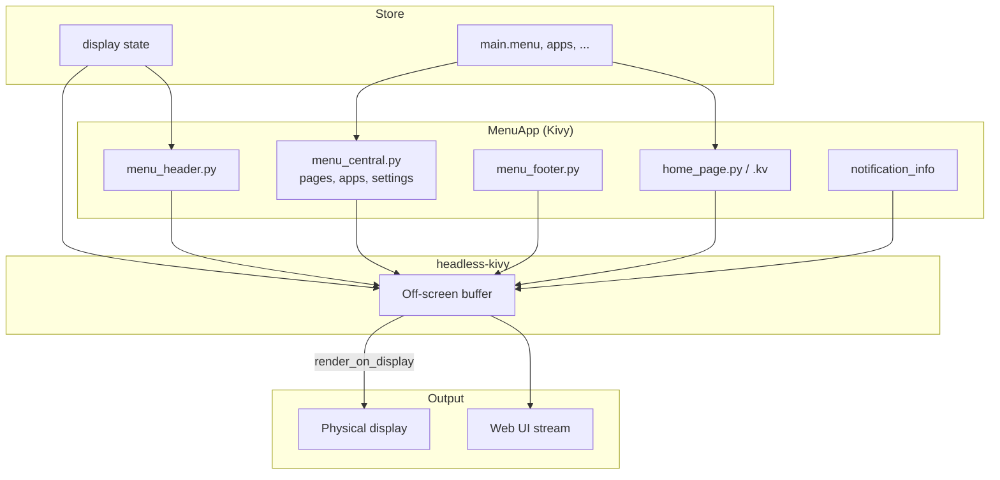

# Menu App

**Architecture**  
Menu App

The **Menu App** is the main Kivy-based GUI. It draws the home screen, menus, and app content on the device display (or headless buffer for the web UI). It lives in `ubo_app/menu_app/` and is started from `ubo_app/main.py`.

## What you see

- **Entry** — `MenuApp` in `menu_app/menu.py` extends `MenuAppCentral`, `MenuAppFooter`, `MenuAppHeader`, and `UboApp` (from `ubo_gui`). It subscribes to store state and reacts to actions/events (e.g. blank display, redraw).
- **Structure**:
  - **menu_central.py** — Central content (pages, apps, settings).
  - **menu_header.py** — Header (e.g. title, icons).
  - **menu_footer.py** — Footer (e.g. back/home, navigation hints).
  - **home_page.py** / **home_page.kv** — Home screen layout (gauges, volume, buttons).
  - **notification_info.py** / **notification_info.kv** — Notification UI.
  - **menu_notification_handler.py** — Handles notification display from the store.
- **Display** — The app uses **headless-kivy**: rendering is done off-screen; `ubo_app.display.render_on_display` sends the framebuffer to the physical display (or emulation). Display state (e.g. blanked) is in the store and the menu app shows a blank overlay when the display is blanked.
- **State** — Menus and open apps come from the store (e.g. `main.menu`, registered apps/settings). The menu app subscribes via autorun/selectors and updates the widget tree when state changes.
- **Input** — Keypad and keyboard input are handled by services; they dispatch actions that the store and menu app react to (e.g. menu navigation, L1/L2/L3 select).

## Navigation

- [Overview](overview.md) — Architecture summary.
- [Ubo App → Home screen](../index.md) — User-facing home screen.
- [Ubo App → Menu](../home/menu.md) — Menu and navigation.
- [Services → Display](../services/display.md) — Display service and redraw events.
