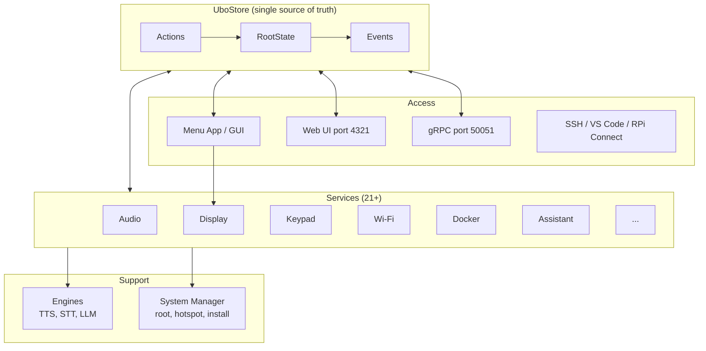

# Overview

**Architecture**  
Overview

Ubo App is built around a **centralized Redux store** and **modular services**. All coordination happens through **immutable state**, **actions**, and **events**—no direct service-to-service calls. Services run in isolated threads with their own event loops and react to store state and events.

## What you see

- **Store** — Single source of truth (`UboStore`). The root state combines slices from core (main, settings, status_icons, update_manager, input) and every service (audio, display, keypad, notifications, wifi, docker, assistant, etc.). See [Store](store.md).
- **Services** — 21+ services in `ubo_app/services/`, each with `setup.py`, `reducer.py`, and `ubo_handle.py`. They register with the store and subscribe to actions/events. See [Services](services.md).
- **RPC** — gRPC server (default port 50051) exposes the store: dispatch actions, subscribe to events and state. See [RPC](rpc.md).
- **Engines** — Pluggable providers for speech (TTS/STT), LLMs, and related backends in `ubo_app/engines/`. See [Engines](engines.md).
- **System** — System manager process (root operations via Unix socket), hotspot, install scripts, and systemd integration. See [System](system.md).
- **Menu App** — Kivy-based GUI (`ubo_app/menu_app/`) that renders the home screen and menus from store state. See [Menu App](menu-app.md).

## Key properties

- **Reactive**: UI and services react to state and events; the web UI can subscribe to display and audio events in real time.
- **Threading**: Store runs on the main thread; a scheduler thread runs async work; each service has a worker thread and event loop.
- **Hardware abstraction**: RPi-specific code (LCD, audio, keypad, sensors, camera, RGB ring) is abstracted; non-RPi environments use mocks (e.g. `python-fake`).
- **Access**: Local GUI, web UI (e.g. port 4321), gRPC (50051), SSH, VS Code tunnel, RPi Connect.

## Navigation

- [Store](store.md) — State shape, reducers, actions, events.
- [Services](services.md) — Service layout, registration, lifecycle.
- [RPC](rpc.md) — gRPC API and proto.
- [Engines](engines.md) — TTS, STT, LLM engines.
- [System](system.md) — System manager, hotspot, install.
- [Menu App](menu-app.md) — GUI and display pipeline.
