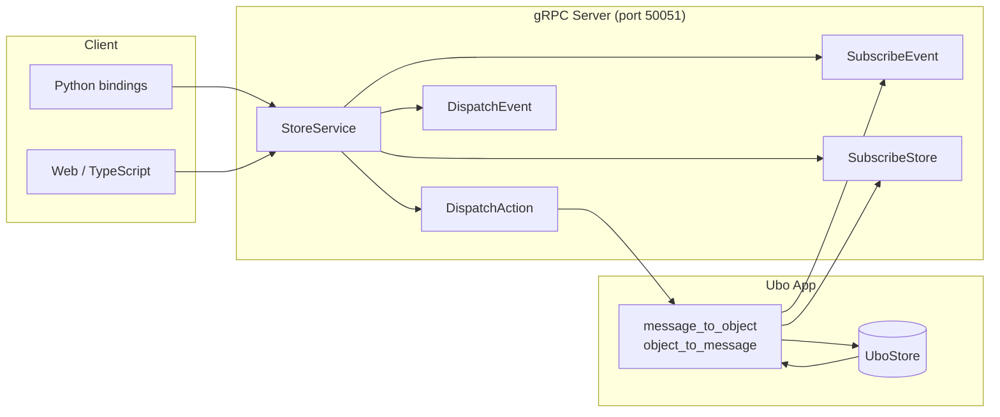

# RPC

**Architecture**  
RPC

Ubo App exposes the store over **gRPC** so remote clients can dispatch actions, dispatch events, and subscribe to store updates and events. The server runs in the worker thread (default port **50051**) unless disabled (e.g. `DISABLE_GRPC`).

## What you see

- **Proto definitions** — Under `ubo_app/rpc/proto/`:
  - **store/v1/store.proto** — `StoreService`: `DispatchAction`, `DispatchEvent`, `SubscribeEvent`, `SubscribeStore`.
  - **secrets/v1/secrets.proto** — Secrets service for sensitive data.
  - **package_info/v1/package_info.proto** — Package info.
- **Generated code** — Python bindings are generated into `ubo_app/rpc/ubo_bindings/` from the proto files (using `betterproto`). Actions and events are also generated from Python store definitions via `ubo_app/rpc/generator/generate_proto.py` (wired into `poe proto`).
- **Server** — `ubo_app/rpc/server.py` runs the gRPC server; it translates between proto messages and store actions/events (see `store_service.py`, `message_to_object.py`, `object_to_message.py`).
- **Clients** — Sample usage and clients: [ubo-grpc-clients](https://github.com/ubopod/ubo-grpc-clients). The in-repo bindings (e.g. `ubo_bindings.client.AsyncRemoteStore`) allow dispatching actions and subscribing from Python.

## Navigation

- [Overview](overview.md) — Architecture summary.
- [Store](store.md) — What is being exposed over RPC.
- [Reference → Proto](../reference/proto.md) — Proto layout and code generation.
