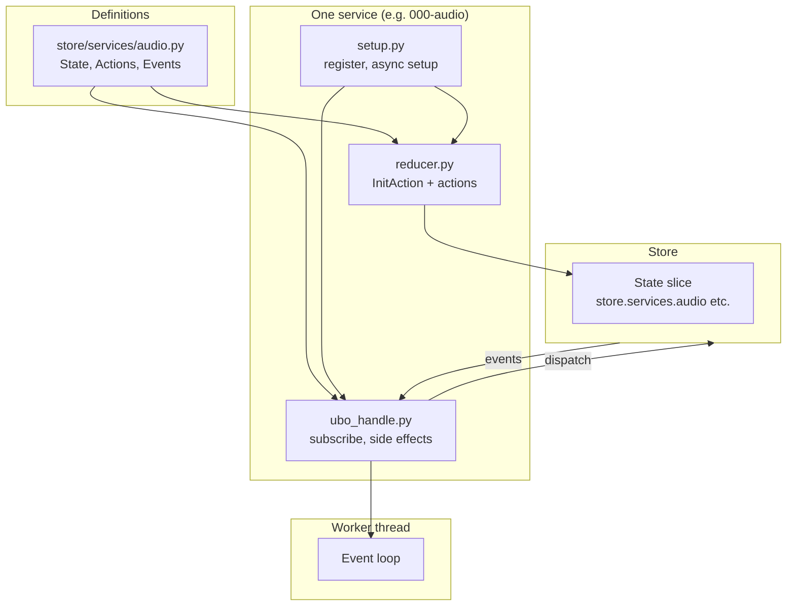

# Services

**Architecture**  
Services

**Services** are the modular components that own hardware, network, or app logic. Each service has its own state slice in the store, a reducer, and a **ubo_handle** that subscribes to actions/events and runs in a dedicated worker thread with an async event loop.

## What you see

- **Layout** — Under `ubo_app/services/`, services are in numbered folders by priority:
  - `000-*` — Hardware (audio, display, keypad)
  - `010-*` — Notifications, speech synthesis
  - `020-*` — Keyboard
  - `030-*` — Network (ethernet, ip, wifi)
  - `040-*` — Camera, RGB ring, sensors
  - `050-*` — LightDM, RPi Connect, SSH, users, VS Code
  - `080-*` — Docker
  - `090-*` — Assistant, file system, infrared, speech recognition, web UI
- **Per-service files**:
  - **State/actions/events** — Defined in `ubo_app/store/services/<name>.py` (e.g. `audio`, `display`).
  - **Reducer** — `reducer.py` in the service folder (e.g. `services/000-audio/reducer.py`) handles `InitAction` and that service’s actions; registered as part of the root reducer.
  - **Setup** — `setup.py` runs once at startup: register the reducer, run async setup, subscribe to store events from `ubo_handle`.
  - **ubo_handle.py** — Subscribes to actions/events and implements the service behavior (e.g. call hardware, dispatch new actions).
- **Threading** — Each service runs in a worker thread. Event handlers are wrapped so they run in that service’s thread/loop, not the main thread.
- **Conventions** — Use `UBO_` for env vars; `ubo:` prefix for core notification/icon ids and `<service_name>:` for service-specific ids. Use `create_task` from `ubo_app.utils.async_` for async work in the service loop.

## Navigation

- [Overview](overview.md) — Architecture summary.
- [Store](store.md) — How service state is combined.
- [Services (docs)](../services/audio.md) — Per-service documentation (Audio, Display, Keypad, etc.).
