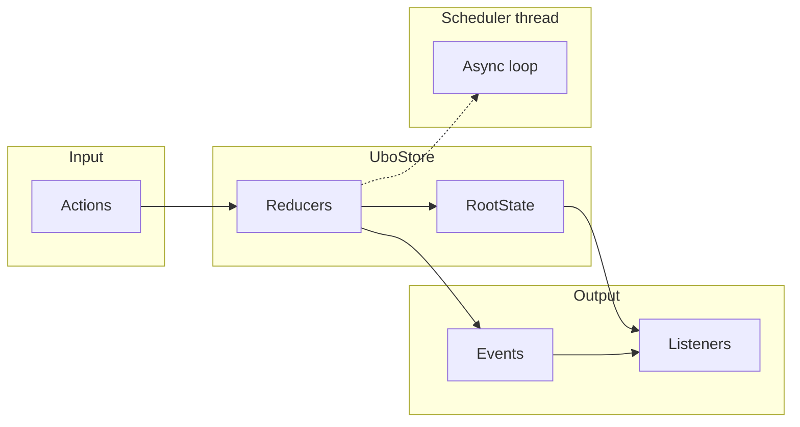

# Store

**Architecture**  
Store

The **store** is the single source of truth for Ubo App. It is a Redux-style store (`UboStore`) that holds immutable state, processes actions through reducers, and emits events to subscribers.

## What you see

- **Root state** (`RootState` in `ubo_app/store/main.py`) — Combines:
  - **Core**: `main`, `settings`, `status_icons`, `update_manager`, `input`
  - **Services**: `audio`, `camera`, `display`, `docker`, `infrared`, `ip`, `keypad`, `lightdm`, `notifications`, `rgb_ring`, `rpi_connect`, `sensors`, `speech_recognition`, `speech_synthesis`, `ssh`, `users`, `vscode`, `web_ui`, `wifi`, and assistant/file_system
- **Actions** — Dispatched to change state or trigger side effects. Typed as `UboAction` (union of all action types from core and services).
- **Events** — Emitted when something happens (e.g. playback done, menu choice). Handlers are subscribed per event type; the store routes them to the correct thread (e.g. service thread).
- **Reducers** — Each slice has a reducer (e.g. `main_reducer`, `settings_reducer`, service reducers). They return updated state and optionally further actions/events.
- **Scheduler** — A dedicated thread runs an async loop used for store-related tasks (e.g. `set` callbacks). The store’s `run()` method processes actions in batches and interleaves event handling so events are processed promptly.

## Key implementation details

- **Serialization** — The store can serialize/deserialize state (e.g. for snapshots and gRPC); it supports immutables, bytes, datetime, sets, and type tags.
- **Autorun** — `_UboAutorun` runs logic when selected state changes; it uses the app’s task runner so async code runs in the right loop.
- **Registration** — Service state slices are registered via `CombineReducerRegisterAction` after initial store creation.

## Navigation

- [Overview](overview.md) — Architecture summary.
- [Services](services.md) — How services register and contribute state.
- [RPC](rpc.md) — How the store is exposed over gRPC.
