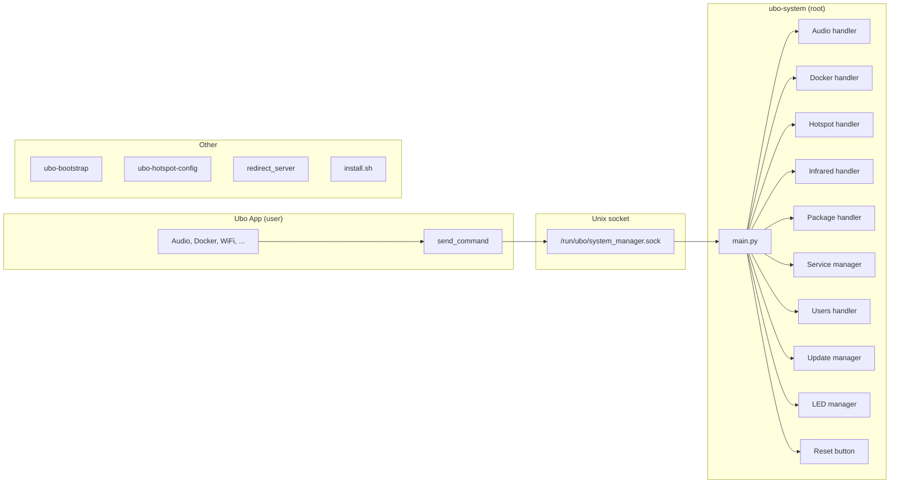

# System

**Architecture**  
System

The **system** layer handles root-privilege operations, hotspot, install, and systemd integration. It is split between the main app and a separate **system manager** process that runs with elevated permissions and communicates over a Unix socket.

## What you see

- **System manager** (`ubo-system`) — Entry point: `ubo_app.system.system_manager.main`. Listens on a Unix socket (e.g. `/run/ubo/system_manager.sock`). Handles commands for:
  - **Audio** — Driver install
  - **Docker** — Install/start/stop
  - **Hotspot** — Configure and control
  - **Infrared** — Hardware-related commands
  - **Package** — Apt/package operations
  - **Service** — systemd service control
  - **Update manager** — Updates
  - **Users** — User management
  - **LED** — LED manager for status
  - **Reset button** — Reset-button handling
- **Bootstrap** (`ubo-bootstrap`) — `ubo_app.system.bootstrap`: early boot setup.
- **Hotspot** — `ubo_app.system.hotspot_config` and `hotspot_templates/` for Wi‑Fi hotspot configuration; `ubo-hotspot-config` script.
- **Redirect server** — `ubo_app.system.redirect_server` for captive-portal style redirects.
- **Install** — Script at `ubo_app/system/scripts/install.sh` (used by “Install on existing OS” in [Getting Started](../getting-started.md)); installs into `/opt/ubo`, optional Docker, and required Debian packages.
- **systemd** — Service templates under `ubo_app/system/services/` (e.g. `ubo-app.service.tmpl`, `ubo-hotspot.service.tmpl`, `ubo-system.service.tmpl`).

The main app sends commands to the system manager via `ubo_app.utils.server.send_command` (or equivalent) instead of running root operations in-process.

## Navigation

- [Overview](overview.md) — Architecture summary.
- [Getting Started](../getting-started.md) — Installation and first run.
- [Settings → System](../home/settings/system.md) — System settings in the UI.
