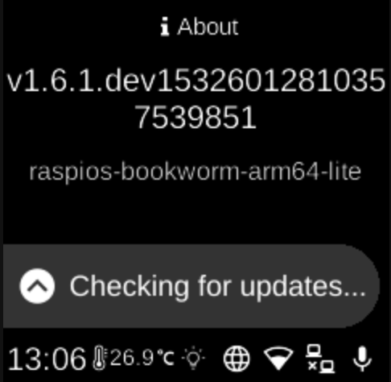

# About

**Ubo App**  
Home screen actions → Menu → About

**About** () shows device and app version information. Open it from the [Menu](menu.md) on the home screen.

## What you see

- A heading with the current **Ubo app version** (e.g. “Ubo v1.2.3”).
- **Base image** information, indicating the underlying system image the device uses.
- Options to manage versions and updates, such as:
  - **Recent versions** — List of recent app versions you can install. Choosing a version may show a confirmation; confirm to start installation.
  - **Installed versions** — List of installed versions. The current version is usually indicated. You can switch to another installed version if more than one is present.
  - Other update-related entries depending on your device.

## Navigation

- Use **UP** and **DOWN** to move between items.
- Use **L1**, **L2**, or **L3** to select an item or confirm an action.
- Use **BACK** to go back one level or close About.
- Use **HOME** to return to the home screen.

Installation or version changes may trigger a restart or reload of the app; follow any on-screen prompts.
