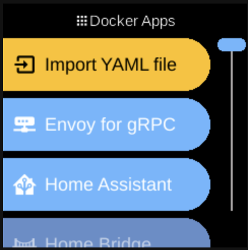

# Apps

**Ubo App**  
Home screen actions → Menu → Apps

**Apps** (Docker Apps 󰀻) lists applications running in Docker on your Ubo device. Open it from the [Menu](menu.md) on the home screen.

## What you see

When you open **Docker Apps**, the list can include:

1. **Import YAML file** (󰋺) — Always shown first. Opens a flow to add a custom Docker composition by providing or importing a `docker-compose.yml` file. Shown with a warning-style (orange) label.
2. **Docker app entries** — One entry per Docker container or composition registered on the device (e.g. Home Assistant, Pi-hole, or compositions you imported). Tapping an entry opens that app’s menu (fetch, start, stop, remove, etc.). Order among these is stable (by key).
3. **File System** (󰉋) — Opens the file browser so you can select and open files or paths on the device. Not a Docker app; it is a built-in app that appears in the same list (see [File System](../services/file-system.md) in Services).

If no Docker app has been registered yet, you still see **Import YAML file** and **File System**. The placeholder **No apps** is used only when the list has no items (e.g. before services have finished loading). The screen title is **Docker Apps**.

## Built-in options (always in the list)

- **Import YAML file** — Add a custom Docker composition. You can paste or provide a `docker-compose.yml` (e.g. from a QR code or Web UI). The composition is stored on the device and appears as a new Docker app entry once added. Shown first in the list.
- **File System** — Open the file path selector to browse and open files or folders on the device. Used when another feature asks you to choose a path. See [File System](../services/file-system.md) for more. Appears after all Docker app entries in the list.

## Available Docker apps

These are the **predefined** Docker container and composition apps that can appear as entries in the Docker Apps list. Each is registered when the Docker service is available; the exact set may depend on your device and configuration. You may also see **imported** apps (compositions you added via **Import YAML file**). Tapping an entry opens that app’s menu (fetch, start, stop, remove, etc.):

- **[Envoy for gRPC](apps/envoy-grpc.md)** — gRPC proxy for Ubo stack.
- **[Home Assistant](apps/home-assistant.md)** — Home automation platform (port 8123).
- **[Home Bridge](apps/home-bridge.md)** — Apple HomeKit bridge for non–HomeKit devices.
- **[Immich](apps/immich.md)** — Self-hosted photo and video backup (port 2283).
- **[Ngrok](apps/ngrok.md)** — Expose local services via secure tunnels (requires auth token).
- **[Ollama](apps/ollama.md)** — Local LLM runtime (port 11434).
- **[Open WebUI](apps/open-webui.md)** — Web UI for chatting with local LLMs (port 8080; uses Ollama).
- **[Pi-hole](apps/pi-hole.md)** — Network-wide ad blocker and DNS (pi.hole; default password: admin).
- **[Portainer](apps/portainer.md)** — Docker container management UI.

## Navigation

- Use **UP** and **DOWN** to move between apps.
- Use **L1**, **L2**, or **L3** to select the first, second, or third item on the screen.
- Use **BACK** to return to the main menu or the home screen.
- Use **HOME** to go to the home screen.

Apps are managed via Docker; the list reflects what is currently available on the device.
