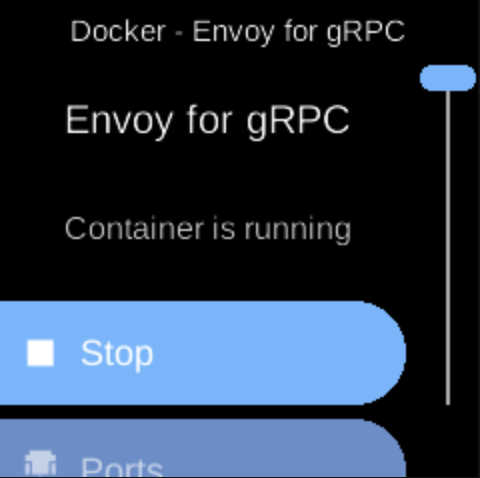

# Envoy for gRPC

**Ubo App**  
Home screen actions → Menu → Apps → Envoy for gRPC

**Envoy for gRPC** (󱂇) runs an Envoy proxy configured for gRPC, used by the Ubo stack for communication. When installed as a Docker app, it appears in [Apps](../apps.md) and can be started, stopped, or managed from its menu.

## On the device

From the Docker Apps list, select **Envoy for gRPC** to open its app menu. There you can start or stop the container, pull images, or remove the app. This service is typically used internally; configuration is prepared automatically from the Ubo environment.
