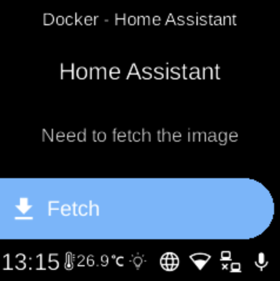

# Home Assistant

**Ubo App**  
Home screen actions → Menu → Apps → Home Assistant

**Home Assistant** (󰟐) is a home automation platform. When installed as a Docker app, it appears in [Apps](../apps.md) and can be started, stopped, or opened from its menu.

## Port

- **8123** — Web UI (HTTP).

## On the device

From the Docker Apps list, select **Home Assistant** to open its app menu. There you can start or stop the container, pull images, or remove the app. When running, open the web interface from a browser using your device’s address and port 8123.
