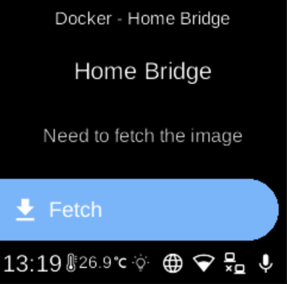

# Home Bridge

**Ubo App**  
Home screen actions → Menu → Apps → Home Bridge

**Home Bridge** (󰘘) brings non–HomeKit devices into Apple Home. When installed as a Docker app, it appears in [Apps](../apps.md) and can be started, stopped, or managed from its menu.

## On the device

From the Docker Apps list, select **Home Bridge** to open its app menu. There you can start or stop the container, pull images, or remove the app. Use the Home Bridge UI or Apple Home to configure your accessories.
