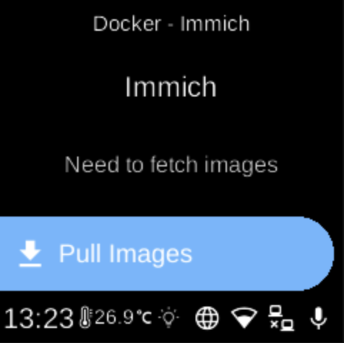

# Immich

**Ubo App**  
Home screen actions → Menu → Apps → Immich

**Immich** () is a self-hosted photo and video backup solution. When installed as a Docker composition, it appears in [Apps](../apps.md) and can be fetched, started, stopped, or removed from its menu. The first time you add it, the app may download and prepare the composition.

## Port

- **2283** — Web UI and API.

## On the device

From the Docker Apps list, select **Immich** to open its app menu. There you can pull images, start or stop the composition, or delete the application. When running, open the web UI in a browser on port 2283 to back up and manage your media.
