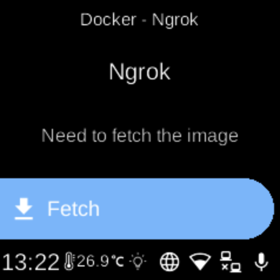

# Ngrok

**Ubo App**  
Home screen actions → Menu → Apps → Ngrok

**Ngrok** (󰛶) exposes local services to the internet via secure tunnels. When installed as a Docker app, it appears in [Apps](../apps.md) and can be started, stopped, or configured from its menu.

## Setup

You need an **Ngrok auth token** from the ngrok dashboard. The app may prompt you to enter it via QR code or Web UI when you first run it. You can also set the tunnel command (e.g. `http 80` or `tcp 22`) when starting.

## On the device

From the Docker Apps list, select **Ngrok** to open its app menu. There you can start or stop the container, pull images, or remove the app. When starting, provide your auth token and the desired tunnel command if prompted.
