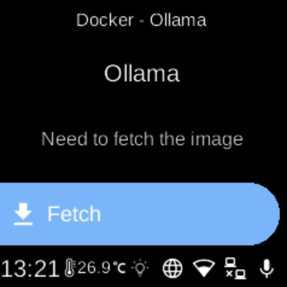

# Ollama

**Ubo App**  
Home screen actions → Menu → Apps → Ollama

**Ollama** (󰳆) runs large language models locally. When installed as a Docker app, it appears in [Apps](../apps.md) and can be started, stopped, or opened from its menu. [Open WebUI](open-webui.md) can use Ollama as a backend.

## Port

- **11434** — API and local inference.

## On the device

From the Docker Apps list, select **Ollama** to open its app menu. There you can start or stop the container, pull images, or remove the app. When running, use the API on port 11434 or connect Open WebUI to it.
