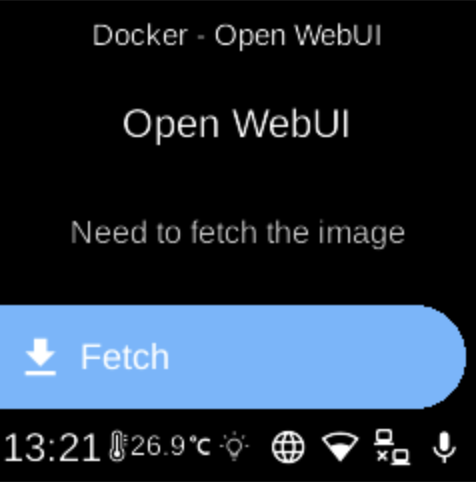

# Open WebUI

**Ubo App**  
Home screen actions → Menu → Apps → Open WebUI

**Open WebUI** (󰾔) is a web interface for chatting with local LLMs. When installed as a Docker app, it appears in [Apps](../apps.md) and can be started, stopped, or opened from its menu. It typically uses [Ollama](ollama.md) as the backend.

## Port

- **8080** — Web UI.

## On the device

From the Docker Apps list, select **Open WebUI** to open its app menu. There you can start or stop the container, pull images, or remove the app. Ensure [Ollama](ollama.md) is running if you use it as the model backend. When running, open the web UI in a browser on port 8080.
