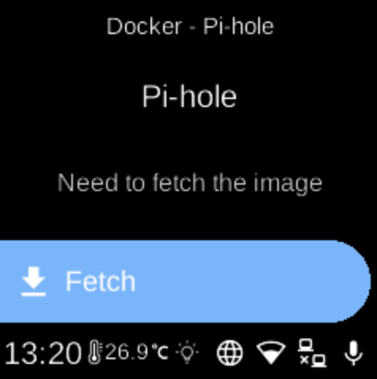

# Pi-hole

**Ubo App**  
Home screen actions → Menu → Apps → Pi-hole

**Pi-hole** (󰇖) is a network-wide ad blocker and DNS sinkhole. When installed as a Docker app, it appears in [Apps](../apps.md) and can be started, stopped, or opened from its menu.

## Access

- **Hostname:** `pi.hole`
- **Default password:** admin

## Ports

- **53** (TCP/UDP) — DNS  
- **80** — Web admin (HTTP)  
- **443** — Web admin (HTTPS)

## On the device

From the Docker Apps list, select **Pi-hole** to open its app menu. There you can start or stop the container, pull images, or remove the app. When running, configure the device to use Pi-hole for DNS (e.g. point DNS to the Ubo device) and open the admin interface in a browser.
