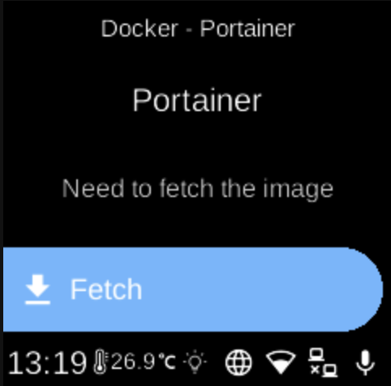

# Portainer

**Ubo App**  
Home screen actions → Menu → Apps → Portainer

**Portainer** () is a container management UI for Docker. When installed as a Docker app, it appears in [Apps](../apps.md) and can be started, stopped, or opened from its menu. It uses the Docker socket to manage containers on the device.

## On the device

From the Docker Apps list, select **Portainer** to open its app menu. There you can start or stop the container, pull images, or remove the app. When running, open the Portainer web UI from a browser to manage Docker containers and images.
