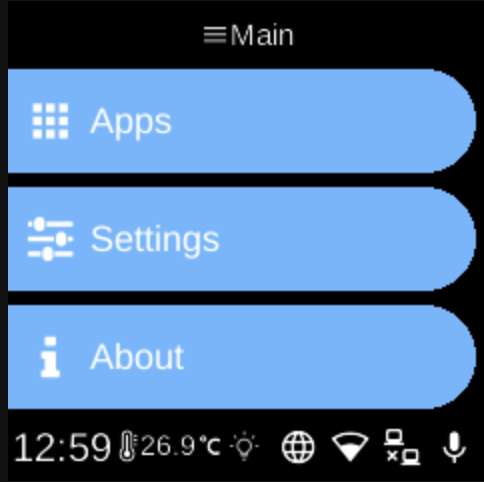

# Menu

**Ubo App**  
Home screen actions → Menu

The **Menu** (hamburger icon 󰍜) on the home screen opens the main navigation. From here you can reach apps, settings, and device information.

## Main menu

After tapping the menu icon, you see three options:

- **[Apps](apps.md)** — Lists Docker apps installed on the device. If none are installed, the list shows “No apps”.
- **[Settings](settings.md)** — Opens the settings menu, organized by category (e.g. Network, Remote, System, Hardware, Assistant, Docker, Accessibility). Each category may contain toggles and service options.
- **[About](about.md)** — Opens the About screen with device and version information.

## Navigation

- Use **UP** and **DOWN** to move between items.
- Use **L1**, **L2**, or **L3** to select the first, second, or third item on the screen.
- Use **BACK** to go back one level or close the menu.
- Use **HOME** to return to the home screen.

Settings and Apps use sub-menus: choose an item to open its sub-menu, then navigate and select as above.
