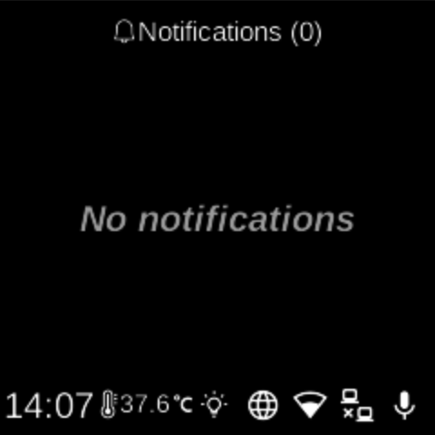

# Notifications

**Ubo App**  
Home screen actions → Notifications

The **Notifications** (bell icon ) on the home screen shows all active alerts and messages. The bell may turn yellow when there are unread notifications.

## Notification list

- The screen title shows **Notifications** and the current unread count, e.g. “Notifications (3)”.
- Each notification appears as a row with a title. Notifications can have different colors and icons depending on importance (e.g. low, normal, high).
- Notifications that have expired (based on their expiration time) are not shown.
- If there are no notifications, the list shows “No notifications”.

## Viewing a notification

- Use **UP** and **DOWN** to move between notifications.
- Use **L1**, **L2**, or **L3** to open the selected notification. The full content is shown in a scrollable view.
- From the detail view you can read the message, see any extra information, and use any actions attached to the notification (e.g. dismiss or open an app).
- Use **BACK** to return to the notification list or to the home screen.

## Unread indicator

The notification icon on the home screen uses a different color when there are unread notifications so you can see at a glance that new alerts are available.
