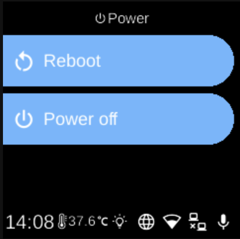

# Power

**Ubo App**  
Home screen actions → Power

The **Power** (power icon 󰐥) on the home screen opens a short menu for shutting down or restarting the device.

## Power options

After tapping the power icon, you see two options:

- **Reboot** — Restarts the device. The system plays a short sound and then reboots. All running apps and services stop and start again after the reboot.
- **Power off** — Shuts down the device. The system plays a short sound and then powers off. You need to power the device on again manually.

## Usage

- Use **UP** and **DOWN** to move between **Reboot** and **Power off**.
- Use **L1** or **L2** to select the first or second option.
- Use **BACK** to close the power menu without doing anything.

After you choose **Reboot** or **Power off**, the action runs immediately; there is no extra confirmation step on this screen.
