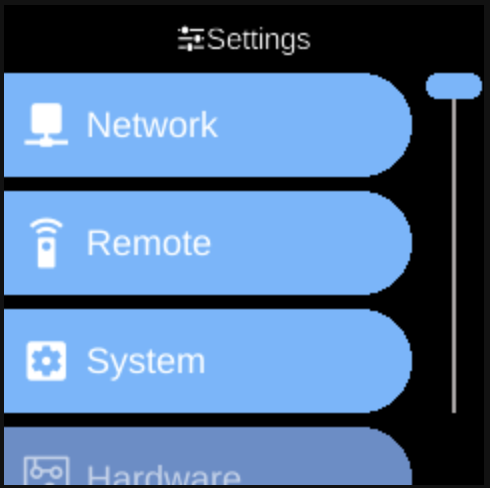

# Settings

**Ubo App**  
Home screen actions → Menu → Settings

**Settings** () opens the device configuration menu. Open it from the [Menu](menu.md) on the home screen. Settings are grouped by category so you can find network, system, and other options quickly.

## Settings categories

When you open Settings, you see categories such as:

- **[Network](settings/network.md)** — Network-related options ([Wi-Fi](../services/wifi.md), [Ethernet](../services/ethernet.md), [IP](../services/ip.md)).
- **[Remote](settings/remote.md)** — Remote access and connectivity ([RPi Connect](settings/rpi-connect.md), [SSH](settings/ssh.md), [VS Code](settings/vscode.md)).
- **[System](settings/system.md)** — General system options: [General](settings/general.md), [Services](settings/services.md), [Users](settings/users.md), [Desktop](settings/desktop.md), [Third Party](settings/third-party.md). See [Architecture → Services](../architecture/services.md) and [System](../architecture/system.md) for overview.
- **[Hardware](settings/hardware.md)** — Hardware-related settings: [Display](settings/display.md), [Camera](settings/camera.md), [Infrared](settings/infrared.md).
- **[Assistant](settings/assistant.md)** — Assistant and voice options.
- **[Docker](settings/docker.md)** — Docker and container options.
- **[Accessibility](settings/accessibility.md)** — [Picovoice Settings](settings/accessibility-picovoice-settings.md), [Speech Synthesis](settings/accessibility-speech-synthesis.md), [Speech Recognition](settings/accessibility-speech-recognition.md).

Each category opens a sub-menu with specific toggles and actions. The exact items depend on your device and installed services.

## Navigation

- Use **UP** and **DOWN** to move between categories and between options inside a category.
- Use **L1**, **L2**, or **L3** to select the first, second, or third item on the screen.
- Use **BACK** to go back one level or leave Settings.
- Use **HOME** to return to the home screen.

Toggle options (e.g. on/off) are changed by selecting them with the action buttons.
