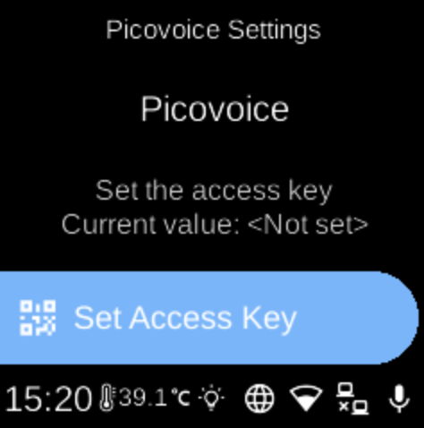

# Picovoice Settings

**Ubo App**  
Home screen actions → Menu → Settings → Accessibility → Picovoice Settings

**Picovoice Settings** (PV) configures Picovoice Orca for text-to-speech. Open it from [Accessibility](accessibility.md) in Settings. You may need an access key to use Picovoice.

## What you see

When you open **Picovoice Settings**, the screen title is **Picovoice Settings** with heading **Picovoice** and a sub-heading that describes the option or how to get an access key. You see menu items such as entering or updating your Picovoice access key (e.g. via QR code or Web UI). The key is stored securely and used when [Speech Synthesis](accessibility-speech-synthesis.md) uses a Picovoice-based engine.

The exact items depend on your device and how the speech synthesis service is configured.

## Navigation

- Use **UP** and **DOWN** to move between options.
- Use **L1**, **L2**, or **L3** to select an item or complete a step (e.g. submit access key).
- Use **BACK** to return to the Accessibility menu.
- Use **HOME** to go to the home screen.
