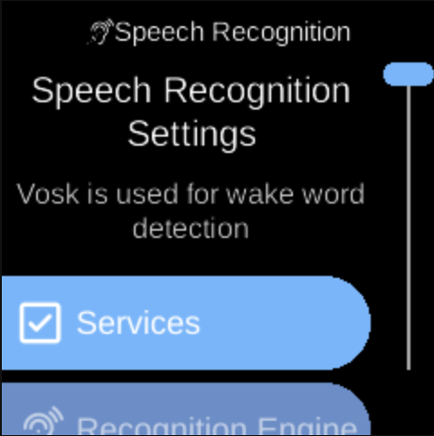

# Speech Recognition

**Ubo App**  
Home screen actions → Menu → Settings → Accessibility → Speech Recognition

**Speech Recognition** () configures voice input and the recognition engine. Open it from [Accessibility](accessibility.md) in Settings. Vosk is used for wake word detection.

## What you see

When you open **Speech Recognition**, the screen title is **Speech Recognition** with heading **Speech Recognition Settings** and sub-heading **Vosk is used for wake word detection**. You see:

- **Services** () — Opens a **Services** sub-menu with options that control when and how speech recognition is used (e.g. assistant active, intents active). The exact items depend on your device.
- **Recognition Engine** () — Opens **Select Active Engine**. The sub-heading indicates which options are **Offline** (on device) vs **Online** (remote). You see a list of engines; the active one is highlighted. Select an engine to set it as the active speech recognition engine for wake word and voice input.

## Navigation

- Use **UP** and **DOWN** to move between **Services** and **Recognition Engine**, and inside each sub-menu between options or engines.
- Use **L1**, **L2**, or **L3** to select an option or choose an engine.
- Use **BACK** to return to the previous menu or Accessibility.
- Use **HOME** to go to the home screen.
