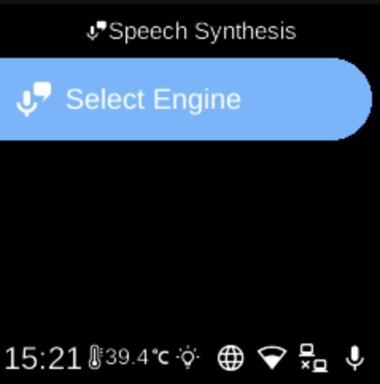

# Speech Synthesis

**Ubo App**  
Home screen actions → Menu → Settings → Accessibility → Speech Synthesis

**Speech Synthesis** (󰔊) controls text-to-speech (TTS): which engine is used and, for Piper, downloading the voice model. Open it from [Accessibility](accessibility.md) in Settings.

## What you see

When you open **Speech Synthesis**, the screen title is **Speech Synthesis**. You may see:

- **Download Piper Model** (󰇚) — Shown when the Piper model is not yet downloaded. Select it to download the Piper voice model so you can use the Piper (offline) engine. After download, this option is hidden.
- **Select Engine** (󰔊) — Opens a list of available TTS engines (e.g. Piper, Picovoice Orca). The current engine is shown in the sub-menu title and highlighted in the list. Select an engine to set it as the active speech synthesis engine. Piper may appear only after the model is downloaded.

Engines may run offline (on the device) or use an online service. For Picovoice, configure your access key in [Picovoice Settings](accessibility-picovoice-settings.md) first.

## Navigation

- Use **UP** and **DOWN** to move between options and (in Select Engine) between engines.
- Use **L1**, **L2**, or **L3** to select an option or choose an engine.
- Use **BACK** to return to the Accessibility menu.
- Use **HOME** to go to the home screen.
