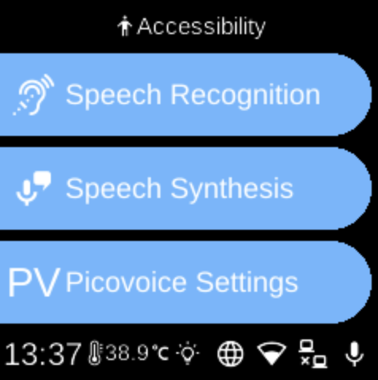

# Accessibility

**Ubo App**  
Home screen actions → Menu → Settings → Accessibility

The **Accessibility** (󰙋) category in [Settings](../settings.md) groups options for speech and input.

## What you see

When you open **Accessibility**, you see:

- **[Picovoice Settings](accessibility-picovoice-settings.md)** (PV) — Configure Picovoice Orca (e.g. access key) for text-to-speech.
- **[Speech Synthesis](accessibility-speech-synthesis.md)** (󰔊) — Choose the TTS engine and download the Piper model if needed.
- **[Speech Recognition](accessibility-speech-recognition.md)** () — Services and Recognition Engine (Vosk used for wake word). Select the active speech-to-text engine.

For keyboard and keypad behaviour, see [Keyboard](../../services/keyboard.md) in Services. The exact Accessibility items depend on your device.

## Navigation

- Use **UP** and **DOWN** to move between options.
- Use **L1**, **L2**, or **L3** to select an item and open its sub-menu or screen.
- Use **BACK** to return to the Settings category list or the main menu.
- Use **HOME** to go to the home screen.
