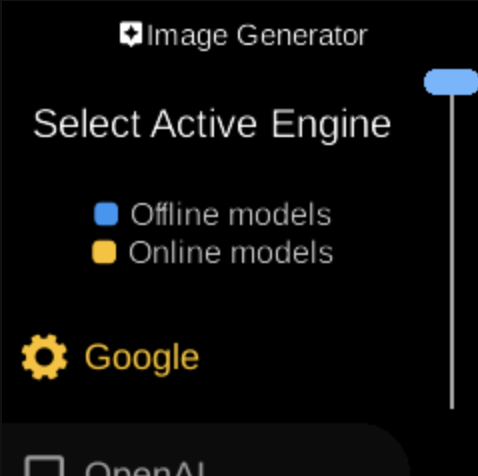

# Image Generator

**Ubo App**  
Home screen actions → Menu → Settings → Assistant → Image Generator

**Image Generator** (󰹉) lets you choose which engine the assistant uses for generating images. Open it from [Assistant](assistant.md) in Settings.

## What you see

When you open **Image Generator**, the screen title is **Image Generator** with heading **Select Active Engine**. The sub-heading indicates that some options are **Offline** models (run on the device) and others **Online** models (use a remote service). You see a list of available engines; the active one is highlighted (e.g. green).

Select an engine to set it as the active image generator for the assistant.

## Navigation

- Use **UP** and **DOWN** to move between engines.
- Use **L1**, **L2**, or **L3** to select an engine.
- Use **BACK** to return to the Assistant menu.
- Use **HOME** to go to the home screen.
