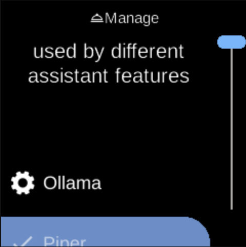

# Manage

**Ubo App**  
Home screen actions → Menu → Settings → Assistant → Manage

**Manage** (󰶗) lets you set up providers used by different assistant features (speech recognition, language model, speech synthesis, image generation). Open it from [Assistant](assistant.md) in Settings.

## What you see

When you open **Manage**, the screen title is **Manage** with heading **Setup providers to be used by different assistant features**. You see a list of provider-related options. Each provider you configure may be used by [Speech Recognition](assistant-speech-recognition.md), [Language Model](assistant-language-model.md), [Speech Synthesis](assistant-speech-synthesis.md), or [Image Generator](assistant-image-generator.md) when you select an engine in those menus.

The exact items depend on your device and which providers are available.

## Navigation

- Use **UP** and **DOWN** to move between options.
- Use **L1**, **L2**, or **L3** to select an option and configure it.
- Use **BACK** to return to the Assistant menu.
- Use **HOME** to go to the home screen.
