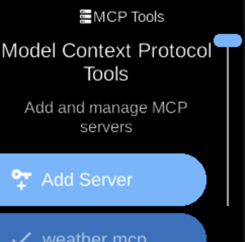

# MCP Tools

**Ubo App**  
Home screen actions → Menu → Settings → Assistant → MCP Tools

**MCP Tools** (󰒋) lets you add and manage Model Context Protocol (MCP) servers used by the assistant. Open it from [Assistant](assistant.md) in Settings.

## What you see

When you open **MCP Tools**, the screen title is **MCP Tools** with heading **Model Context Protocol Tools** and sub-heading **Add and manage MCP servers**. You see a list of registered MCP servers and an option to add a new server. MCP servers extend the assistant with tools and data (e.g. APIs, file access).

You can add a server (e.g. by URL or configuration) and remove existing ones. The list may be empty until you add servers.

## Navigation

- Use **UP** and **DOWN** to move between servers and the add option.
- Use **L1**, **L2**, or **L3** to select an item, add a server, or remove one.
- Use **BACK** to return to the Assistant menu.
- Use **HOME** to go to the home screen.
