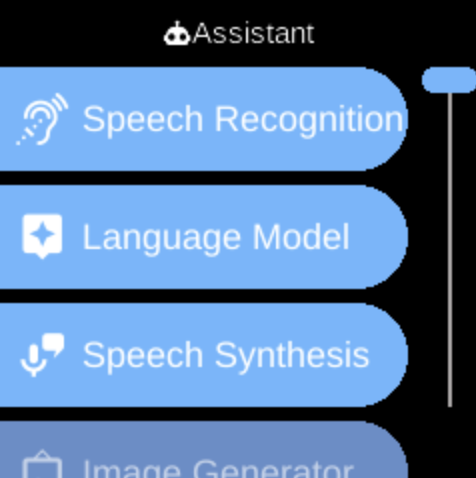

# Assistant

**Ubo App**  
Home screen actions → Menu → Settings → Assistant

The **Assistant** (󰚩) category in [Settings](../settings.md) groups options for the on-device voice assistant: providers, engines, and MCP tools.

## What you see

When you open **Assistant**, you see:

- **[Manage](assistant-manage.md)** (󰶗) — Setup providers used by assistant features (speech, language model, image generation).
- **[MCP Tools](assistant-mcp-tools.md)** (󰒋) — Add and manage Model Context Protocol (MCP) servers.
- **[Image Generator](assistant-image-generator.md)** (󰹉) — Select the active image-generation engine (offline or online).
- **[Speech Synthesis](assistant-speech-synthesis.md)** (󰔊) — Select the active text-to-speech engine.
- **[Language Model](assistant-language-model.md)** (󰁤) — Select the active language model (LLM) engine.
- **[Speech Recognition](assistant-speech-recognition.md)** () — Select the active speech-to-text engine (e.g. for wake word and voice input).

The exact items and engines depend on your device and configuration.

## Navigation

- Use **UP** and **DOWN** to move between options.
- Use **L1**, **L2**, or **L3** to select an item and open its sub-menu or screen.
- Use **BACK** to return to the Settings category list or the main menu.
- Use **HOME** to go to the home screen.
