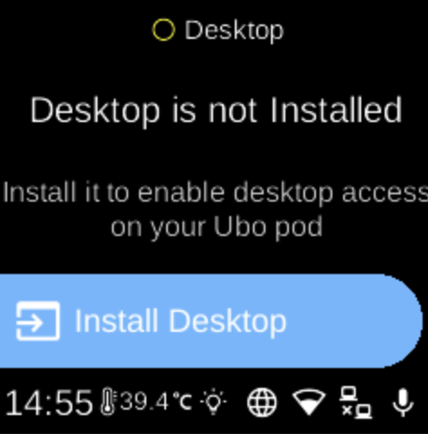

# Desktop

**Ubo App**  
Home screen actions → Menu → Settings → System → Desktop

**Desktop** controls the LightDM display manager, which provides desktop (graphical) login and session access on the device. Open it from [Settings](../settings.md) → **System**. The icon shows whether the service is running (e.g. green) or stopped (e.g. grey).

## What you see

When you open **Desktop**, the screen title reflects the current state. You may see:

- **Not installed** — Heading “Desktop is not Installed” and sub-heading about enabling desktop access. **Install Desktop** (󰶮) installs the desktop package (e.g. `raspberrypi-ui-mods` and LightDM). This may take a few minutes; while installing you see “Installing Desktop” and “This may take a few minutes”.
- **Installed** — **Start** / **Stop** (󰐊 / 󰓛) to start or stop the LightDM service, and **Enable** / **Disable** to enable or disable it at boot. If the enabled state is still being checked, you may see “...” until it is known.

## Navigation

- Use **UP** and **DOWN** to move between options.
- Use **L1**, **L2**, or **L3** to select an option or run an action (Install, Start, Stop, Enable, Disable).
- Use **BACK** to return to the System settings list or the main menu.
- Use **HOME** to go to the home screen.
