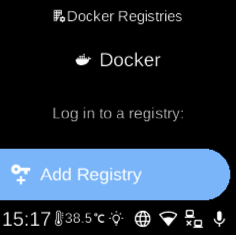

# Registries

**Ubo App**  
Home screen actions → Menu → Settings → Docker → Registries

**Registries** (󱥉) lets you log in to Docker registries (e.g. docker.io) so the device can pull private images. Open it from [Docker](docker.md) in Settings.

## What you see

When you open **Registries**, the screen title is **Docker Registries** with heading **Docker** and sub-heading **Log in to a registry:**. You see:

- **Add Registry** (󰌉) — Add or update credentials for a registry. You may be prompted to enter credentials (e.g. service name, username, password) via QR code or Web UI. Format is often like `registry|username|password` (e.g. `docker.io|user|secret`). If you omit the registry, `docker.io` is often used by default.
- **Registries** (󱕴) — Shown only when you have logged-in registries. Opens **Logged in Registries** with sub-heading “Log out of any registry by selecting it”. Each saved registry appears as a row; select one to **log out** (remove credentials) for that registry. Logging out uses a warning-style (e.g. red) action.

If you have not added any registry, only **Add Registry** is shown.

## Navigation

- Use **UP** and **DOWN** to move between **Add Registry** and (if present) **Registries**, and inside **Registries** between registry names.
- Use **L1**, **L2**, or **L3** to select an option, add credentials, or log out of a registry.
- Use **BACK** to return to the Docker settings list.
- Use **HOME** to go to the home screen.
