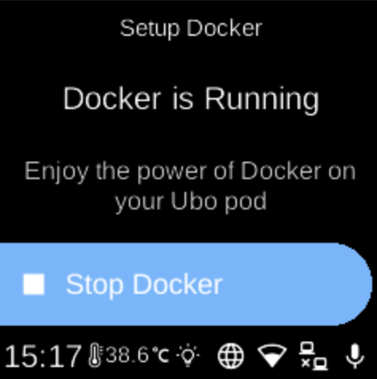

# Service

**Ubo App**  
Home screen actions → Menu → Settings → Docker → Service

**Service** () lets you install, start, or stop the Docker service on the device. Open it from [Docker](docker.md) in Settings. The screen you see depends on the current Docker status.

## What you see

When you open **Service**, the title is **Setup Docker**. The heading and options change with status:

- **Checking** — “Checking Docker service status”. Shown briefly while the device checks if Docker is installed and running.
- **Docker is not Installed** — Sub-heading: “Install it to enjoy the power of Docker on your Ubo pod.” **Install Docker** (󰶮) starts installation.
- **Installing...** — “Docker is being installed.” No actions; wait until installation finishes.
- **Docker is not Running** — “Run it to enjoy the power of Docker on your Ubo pod.” **Start Docker** (󰐊) starts the Docker service.
- **Docker is Running** — “Enjoy the power of Docker on your Ubo pod.” **Stop Docker** (󰓛) stops the service.
- **Docker Error** — “Please check the logs for more information.” No actions; use logs to troubleshoot.

After installing or starting Docker, [Apps](../apps.md) can list container and composition apps, and you can use [Registries](docker-registries.md) to log in to registries.

## Navigation

- Use **UP** and **DOWN** to move between options (when any are shown).
- Use **L1**, **L2**, or **L3** to select **Install Docker**, **Start Docker**, or **Stop Docker**.
- Use **BACK** to return to the Docker settings list.
- Use **HOME** to go to the home screen.
