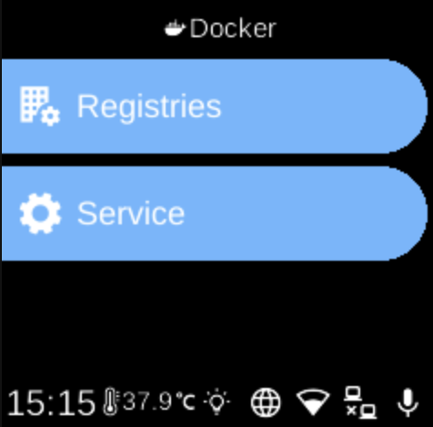

# Docker

**Ubo App**  
Home screen actions → Menu → Settings → Docker

The **Docker** (󰡨) category in [Settings](../settings.md) groups options for the Docker service and container management on the device.

## What you see

When you open **Docker**, you see:

- **[Service](docker-service.md)** () — Install, start, or stop the Docker service. If Docker is not installed, you can install it from here; if it is not running, you can start it. The screen shows status (e.g. Checking, Not Installed, Not Running, Running, Error) and the right action (Install Docker, Start Docker, Stop Docker).
- **[Registries](docker-registries.md)** (󱥉) — Log in to Docker registries (e.g. docker.io). Add credentials via QR code or Web UI so the device can pull private images. The sub-menu lists saved registries; select one to log out and remove its credentials.

See [Docker service](../../services/docker.md) for technical details. For running apps, see [Apps](../apps.md) and the [Docker apps](../apps/home-assistant.md) list.

## Navigation

- Use **UP** and **DOWN** to move between options.
- Use **L1**, **L2**, or **L3** to select an item and open its sub-menu or screen.
- Use **BACK** to return to the Settings category list or the main menu.
- Use **HOME** to go to the home screen.
