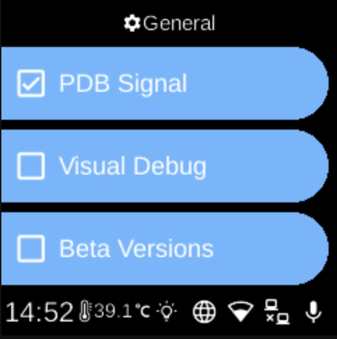

# General

**Ubo App**  
Home screen actions → Menu → Settings → System → General

**General** (󰒓) holds development and testing toggles. Open it from [Settings](../settings.md) → **System**. These options are aimed at developers or testers.

## What you see

When you open **General**, the screen title is **General** and you see:

- **PDB Signal** — When enabled, the device can respond to PDB (Python debugger) signals so you can attach a debugger. The icon shows whether it is on (󰱒) or off (󰄱).
- **Visual Debug** — When enabled, turns on visual debugging features. The icon shows on (󰱒) or off (󰄱).
- **Beta Versions** — When enabled, allows beta or pre-release versions to be used (e.g. for updates). The icon shows on (󰱒) or off (󰄱).

Select an item to toggle it on or off.

## Navigation

- Use **UP** and **DOWN** to move between options.
- Use **L1**, **L2**, or **L3** to select an option and toggle it.
- Use **BACK** to return to the System settings list or the main menu.
- Use **HOME** to go to the home screen.
