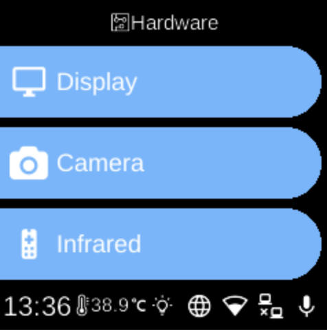

# Hardware

**Ubo App**  
Home screen actions → Menu → Settings → Hardware

The **Hardware** () category in [Settings](../settings.md) groups options for display, camera, and infrared on the device.

## What you see

- **[Display](display.md)** — Screen timeout: choose how long before the screen blanks after inactivity (e.g. 1 min, 5 min, 10 min, 30 min, 1 hour, or Off).
- **[Camera](camera.md)** — Select which camera device to use and run **Detect Cameras** to scan for connected cameras.
- **[Infrared](infrared.md)** — Replay devices, add/remove IR remotes, and set Receive Keys / Propagate Keys.

The exact items depend on your device and which hardware services are available.

## Navigation

- Use **UP** and **DOWN** to move between options.
- Use **L1**, **L2**, or **L3** to select an item and open its sub-menu or screen.
- Use **BACK** to return to the Settings category list or the main menu.
- Use **HOME** to go to the home screen.
