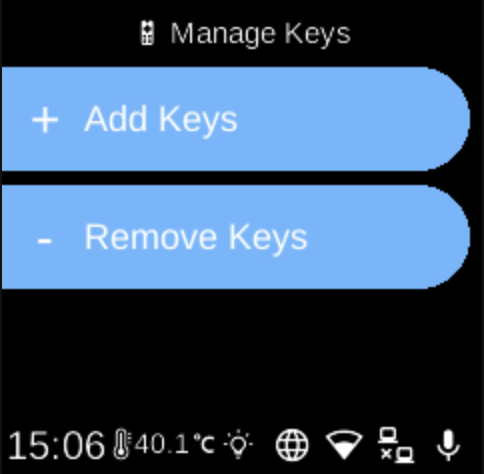

# Manage Keys

**Ubo App**  
Home screen actions → Menu → Settings → Hardware → Infrared → Manage Keys

**Manage Keys** (󰻅) lets you add new IR remotes or remove registered devices. Open it from [Infrared](infrared.md) in Hardware settings.

## What you see

When you open **Manage Keys**, the screen title is **Manage Keys** and you see:

- **Add Keys** (+) — Start pairing a new IR remote. The device will listen for IR signals. You may be prompted to point the remote at the Ubo device and press a button to capture the code. Follow the on-screen steps to name and save the device. **BACK** or **HOME** during pairing may cancel registration.
- **Remove Keys** (-) — Open a list of all registered devices. Select a device to remove it. After removal, that device no longer appears in [Replay Devices](infrared-replay-devices.md). If no devices are registered, the list shows **No devices registered**.

## Navigation

- Use **UP** and **DOWN** to move between **Add Keys**, **Remove Keys**, and (in Remove Keys) between devices.
- Use **L1**, **L2**, or **L3** to select an option or confirm removal.
- Use **BACK** to go back one level or cancel pairing.
- Use **HOME** to return to the home screen (may cancel pairing).
