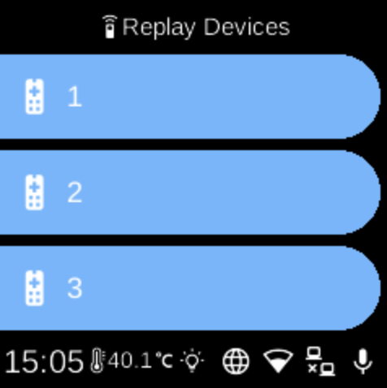

# Replay Devices

**Ubo App**  
Home screen actions → Menu → Settings → Hardware → Infrared → Replay Devices

**Replay Devices** (󰑔) lists your registered IR remote devices so you can send (replay) a device’s IR code. Open it from [Infrared](infrared.md) in Hardware settings.

## What you see

When you open **Replay Devices**, the screen title is **Replay Devices**. You see one row per registered device, each showing the device name you gave when pairing. If no devices are registered, the list shows **No devices registered**.

## How to use

- Select a device to send its IR code. The device emits the infrared signal for that remote (e.g. to control a TV or other equipment).
- To add devices, go back to [Infrared](infrared.md) and choose **[Manage Keys](infrared-manage-keys.md)** → **Add Keys**.
- To remove a device, use [Manage Keys](infrared-manage-keys.md) → **Remove Keys**.

## Navigation

- Use **UP** and **DOWN** to move between devices.
- Use **L1**, **L2**, or **L3** to select a device and replay its code.
- Use **BACK** to return to the Infrared menu.
- Use **HOME** to go to the home screen.
