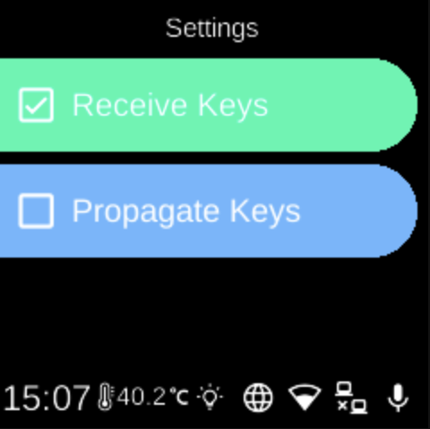

# Infrared Settings

**Ubo App**  
Home screen actions → Menu → Settings → Hardware → Infrared → Settings

**Infrared Settings** () controls whether the device receives IR keypresses and whether keypad actions are propagated. Open it from [Infrared](infrared.md) in Hardware settings.

## What you see

When you open **Settings** (under Infrared), the screen title is **Settings** and you see two toggles. The currently selected state for each is highlighted (e.g. green or distinct style).

- **Receive Keys** — When **on**, the device accepts IR keypresses from a remote (e.g. for [Replay Devices](infrared-replay-devices.md) or other IR features). When **off**, IR input is ignored.
- **Propagate Keys** — When **on**, keypad actions are propagated (e.g. sent to other systems or apps). When **off**, they are not propagated. Use this to control whether IR-originated or keypad-originated keys are forwarded.

Select an option to toggle it on or off.

## Navigation

- Use **UP** and **DOWN** to move between **Receive Keys** and **Propagate Keys**.
- Use **L1**, **L2**, or **L3** to select an option and toggle it.
- Use **BACK** to return to the Infrared menu.
- Use **HOME** to go to the home screen.
