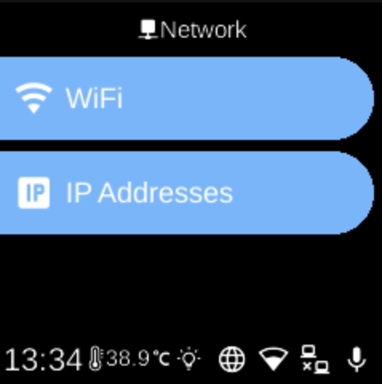

# Network

**Ubo App**  
Home screen actions → Menu → Settings → Network

The **Network** (󰛳) category in [Settings](../settings.md) groups options for connecting the device to networks and managing network interfaces.

## What you see

- **[Wi-Fi](wifi.md)** — Connect to or configure Wi‑Fi networks, view status, and manage saved networks. Add networks, select from saved ones, and connect or disconnect.
- **[Ethernet](../../services/ethernet.md)** — Wired network connection and configuration.
- **[IP](../../services/ip.md)** — View or configure IP addresses and network interfaces.

The exact items depend on your device and which services are enabled.

## Navigation

- Use **UP** and **DOWN** to move between options.
- Use **L1**, **L2**, or **L3** to select an item and open its sub-menu or screen.
- Use **BACK** to return to the Settings category list or the main menu.
- Use **HOME** to go to the home screen.
