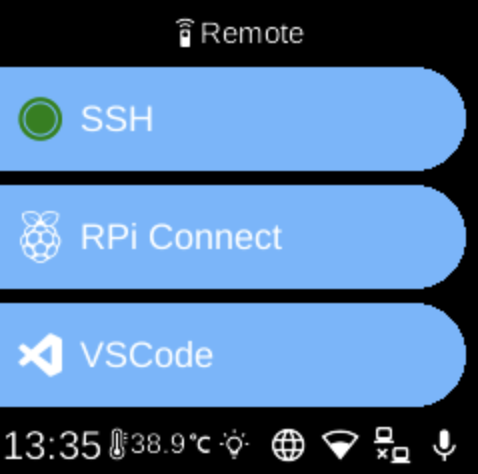

# Remote

**Ubo App**  
Home screen actions → Menu → Settings → Remote

The **Remote** (󰑔) category in [Settings](../settings.md) groups options for remote access and development connectivity.

## What you see

- **[RPi Connect](rpi-connect.md)** — Remote access: screen sharing and remote shell. Install, start/stop, sign in, and show connection URL.
- **[SSH](ssh.md)** — Enable or disable SSH and start or stop the SSH service for secure shell access.
- **[VS Code](vscode.md)** — VS Code Remote Tunnel: download Code CLI, log in, and show URL/QR code to connect from VS Code.

The exact items depend on your device and which services are installed.

## Navigation

- Use **UP** and **DOWN** to move between options.
- Use **L1**, **L2**, or **L3** to select an item and open its sub-menu or screen.
- Use **BACK** to return to the Settings category list or the main menu.
- Use **HOME** to go to the home screen.
