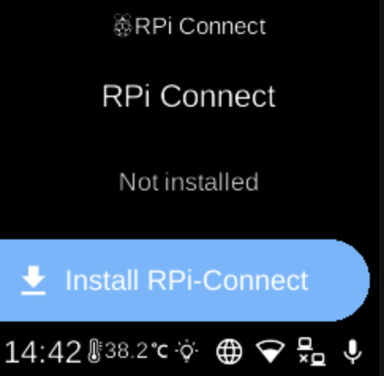

# RPi Connect

**Ubo App**  
Home screen actions → Menu → Settings → Remote → RPi Connect

**RPi Connect** () lets you access your Ubo device remotely for screen sharing and remote shell. Open it from [Settings](../settings.md) → **Remote**.

## RPi Connect menu

When you open RPi Connect, the screen shows the heading **RPi Connect** and a status line (e.g. screen sharing and remote shell session counts, “Not installed”, “Not running”, “Needs authentication”, or “Downloading...”).

## What you see

Depending on state, you may see:

- **Show URL** (󰐲) — When there are active screen sharing or remote shell sessions, opens a screen with a URL or QR code so you can connect from another device.
- **Sign in** / **Sign out** — Sign in to your RPi Connect account, or sign out if already signed in.
- **Start** / **Stop** (󰐊 / 󰓛) — Start or stop the RPi Connect service on the device.
- **Install RPi-Connect** / **Uninstall RPi-Connect** (󰇚) — Install the service if it is not installed, or uninstall it if it is.

If the service is downloading or status is unknown, some options may be hidden until the state is known.

## Navigation

- Use **UP** and **DOWN** to move between options.
- Use **L1**, **L2**, or **L3** to select an option or run an action.
- Use **BACK** to return to the Remote settings list or the main menu.
- Use **HOME** to go to the home screen.
