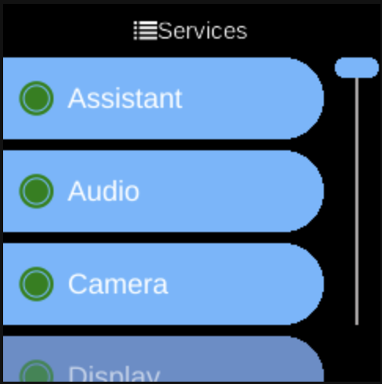

# Services

**Ubo App**  
Home screen actions → Menu → Settings → System → Services

**Services** () lists Ubo’s configurable system services. Open it from [Settings](../settings.md) → **System**. Each entry opens that service’s menu so you can start or stop it, set log level, and view errors.

## What you see

When you open **Services**, you see a list of services (e.g. Audio, Display, Keypad, Docker), sorted by label. Each row shows the service name and an icon indicating whether it is running (e.g. green), stopped (e.g. grey), or has errors (e.g. warning).

Select a service to open its **service menu**, which can include:

- **Start** / **Stop** — Start or stop the service.
- **Auto Load** — Enable or disable the service so it starts automatically at boot.
- **Level: &lt;name&gt;** — Open a sub-menu to set the **log level** (e.g. DEBUG, INFO, WARNING, ERROR). The current level is shown and you pick another to change it.
- **Auto Restart** — Turn on or off automatic restart of the service when it exits.
- **Errors** — If the service has reported errors, open a list of error messages with timestamps.
- **Clear errors** — Clear the stored error list for that service.

The exact items depend on whether the service is running and whether it has errors. See [Architecture → Services](../../architecture/services.md) for an overview of services.

## Navigation

- Use **UP** and **DOWN** to move between services or between options in a service menu.
- Use **L1**, **L2**, or **L3** to select an option or change a setting.
- Use **BACK** to go back one level or leave Services.
- Use **HOME** to return to the home screen.
