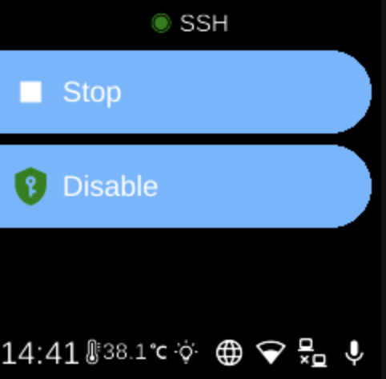

# SSH

**Ubo App**  
Home screen actions → Menu → Settings → Remote → SSH

**SSH** lets you enable or disable SSH access to the device and start or stop the SSH service. Open it from [Settings](../settings.md) → **Remote**. This is the service that allows secure shell (SSH) logins from another computer.

## SSH menu

When you open SSH, the screen title shows the current state (e.g. running or stopped) and you see options such as:

- **Start** / **Stop** (󰐊 / 󰓛) — Start or stop the SSH service. When the service is running, you can connect from another machine using SSH (e.g. `ssh user@device-address`).
- **Enable** / **Disable** — Enable or disable the SSH service so it starts automatically at boot (enable) or does not (disable). If the device is still checking, you may see “...” until the enabled state is known.

The icon next to **SSH** in the title reflects whether the service is running (e.g. green) or stopped (e.g. grey).

## Navigation

- Use **UP** and **DOWN** to move between options.
- Use **L1**, **L2**, or **L3** to select an option and run it (Start, Stop, Enable, or Disable).
- Use **BACK** to return to the Remote settings list or the main menu.
- Use **HOME** to go to the home screen.
