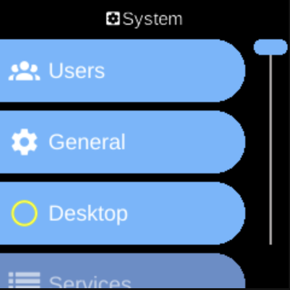

# System

**Ubo App**  
Home screen actions → Menu → Settings → System

The **System** (󰒔) category in [Settings](../settings.md) groups general system options: development toggles, a list of configurable services, and third-party tools.

## What you see

- **[General](general.md)** — Toggles for **PDB Signal** (debugger), **Visual Debug**, and **Beta Versions**. Aimed at developers or testers.
- **[Services](services.md)** — List of configurable system services. Each entry opens that service’s menu (Start/Stop, Auto Load, log level, errors). See [Architecture → Services](../../architecture/services.md) for an overview.
- **[Users](users.md)** — Add user accounts, reset passwords, and delete users (except the default account).
- **[Desktop](desktop.md)** — Install, start, stop, or enable the desktop (LightDM) for graphical login and sessions.
- **[Third Party](third-party.md)** — Optional tools (e.g. Re/Install Audio for certain speaker hardware). The list depends on your device.

The exact items depend on your device and configuration.

## Navigation

- Use **UP** and **DOWN** to move between options.
- Use **L1**, **L2**, or **L3** to select an item and open its sub-menu or screen.
- Use **BACK** to return to the Settings category list or the main menu.
- Use **HOME** to go to the home screen.
