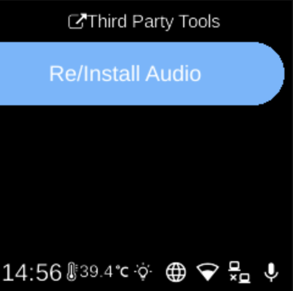

# Third Party

**Ubo App**  
Home screen actions → Menu → Settings → System → Third Party

**Third Party** () lists optional tools that depend on your device hardware. Open it from [Settings](../settings.md) → **System**. The list is built from detected hardware (e.g. certain audio hardware).

## What you see

When you open **Third Party**, the screen title is **Third Party Tools**. You may see:

- **Re/Install Audio** — Reinstall or install the audio driver for compatible speaker hardware (e.g. WM8960). Shown only when the device has the matching audio hardware.

If no third-party tools are available for your device, the list may be empty or show a placeholder.

## Navigation

- Use **UP** and **DOWN** to move between options.
- Use **L1**, **L2**, or **L3** to select an option and run it.
- Use **BACK** to return to the System settings list or the main menu.
- Use **HOME** to go to the home screen.
