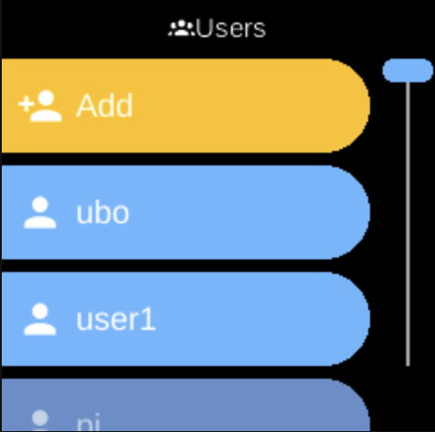

# Users

**Ubo App**  
Home screen actions → Menu → Settings → System → Users

**Users** (󰡉) lets you add device user accounts, reset passwords, and delete users. Open it from [Settings](../settings.md) → **System**. The list reflects accounts on the device (e.g. from the system accounts service).

## What you see

When you open **Users**, the screen title is **Users**. While loading you may see “Loading...” and “Please wait...”. Once loaded you see:

- **Add** (󰀔) — Add a new user account. Opens a flow to create an account (e.g. via Web UI or device prompt). Shown with a warning-style (orange) label.
- **One entry per user** — Each existing user appears by username (e.g. `ubo`). Select a user to open their options.

## Per-user options

When you select a user, you see:

- **Reset Password** (󰯄) — Start the process to reset that user’s password. You may be prompted for the new password (e.g. via Web UI or QR code). Shown with a warning-style label.
- **Delete** (󰀕) — Delete that user account. A confirmation may be shown. The default user (e.g. `ubo`) cannot be removed and may not show Delete, or the option may be disabled.

## Navigation

- Use **UP** and **DOWN** to move between **Add**, user names, and (inside a user) between Reset Password and Delete.
- Use **L1**, **L2**, or **L3** to select an option or confirm an action.
- Use **BACK** to go back one level or leave Users.
- Use **HOME** to return to the home screen.
