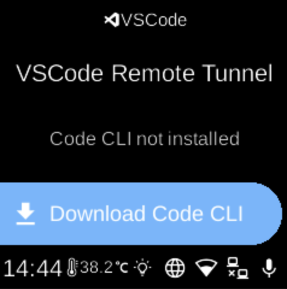

# VS Code

**Ubo App**  
Home screen actions → Menu → Settings → Remote → VS Code

**VS Code** (󰨞) sets up the VS Code CLI and remote tunnel so you can connect to the device from VS Code on your computer. Open it from [Settings](../settings.md) → **Remote**.

## VSCode menu

When you open VS Code, the screen shows the heading **VSCode Remote Tunnel** and a status line (e.g. “Service is running”, “Code CLI not installed”, “Needs authentication”, “Downloading...”, or “Checking status...”).

## What you see

Depending on state, you may see:

- **Show URL** (󰐲) — When the tunnel service is running, opens a screen with a URL (and often a QR code) so you can connect from VS Code on another device.
- **Login** / **Logout** (󰍂 / 󰍃) — Log in with your Microsoft/GitHub account for the tunnel, or log out.
- **Download Code CLI** / **Redownload Code** (󰇚) — Download or re-download the VS Code CLI used for the remote tunnel. Shown when the CLI is not installed or when you want to refresh it.

If the CLI is downloading or status is being checked, some options may be hidden until the state is known.

## Navigation

- Use **UP** and **DOWN** to move between options.
- Use **L1**, **L2**, or **L3** to select an option or run an action.
- Use **BACK** to return to the Remote settings list or the main menu.
- Use **HOME** to go to the home screen.
