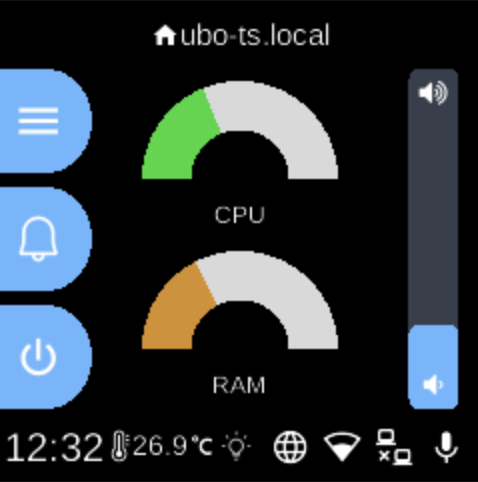

# Ubo App

**Ubo App**  
Home screen

Documentation for the Ubo device application.

## Home screen

The home screen is the main dashboard for your Ubo device. At the top you see the device name (for example, `ubo-ts.local`) and a home icon.

**Left side** — Three main actions:

- **[Menu](home/menu.md)** (hamburger icon) opens the main settings and options.
- **[Notifications](home/notifications.md)** (bell) shows alerts.
- **[Power](home/power.md)** lets you shut down or restart the device.

**Center** — Two gauges show live **CPU** and **RAM** usage so you can see how busy the device is at a glance.

**Right side** — A **volume** slider controls sound level, and the **up** and **down** buttons adjust values (for example, when scrolling or changing settings).

**Bottom bar** — The current **time**, **temperature**, and status icons for network, Wi‑Fi, display, and microphone. At the far bottom, **back** and **home** buttons let you move between screens and return here.
