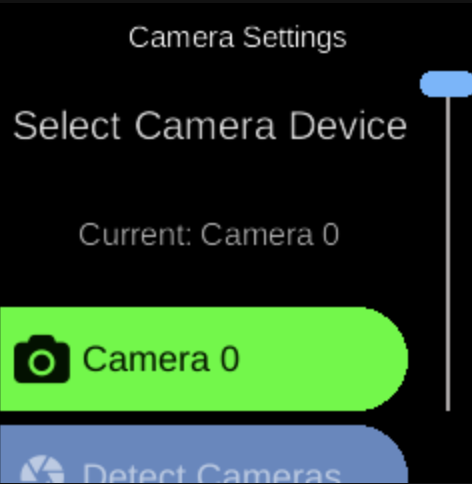

# Camera

**Services**  
Camera

*Image: Camera / viewfinder (placeholder).*

The **Camera** service controls the device camera: start/stop viewfinder, barcode/QR detection, and selection of camera index. Used for QR-based WiFi onboarding, registry login, and other flows that need a live image or barcode.

## What you see

- **State** (`CameraState`) — Active camera index, available cameras list, viewfinder state, last detected barcode/QR payload.
- **Actions** — `CameraStartViewfinderAction`, `CameraReportBarcodeAction`, `CameraSetIndexAction`, `CameraDetectAction`, `CameraSetAvailableCamerasAction`.
- **Implementation** — `ubo_app/services/040-camera/`: `camera_backend.py`, `picamera2_backend.py`, `opencv_backend.py`, `pages.py`, reducer, setup, ubo_handle. On non-RPi, may read from `/tmp/qrcode_input.txt` or `/tmp/qrcode_input.png` for testing.

## Navigation

- [Architecture → Services](../architecture/services.md)
- [Home → Settings → Camera](../home/settings/camera.md)
- [Services → Wi-Fi](wifi.md) — QR onboarding
- [Services → Docker](docker.md) — Registry QR
